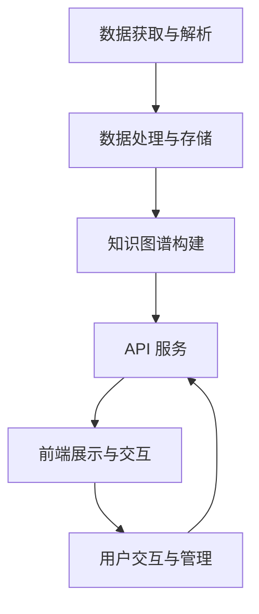

### **要素关系图生成方案设计**

本方案旨在构建一个自动化系统，通过解析综述文章及其引用文献，提取算法实体及其要素，生成要素关系图，并在网页上进行可视化展示和交互。以下是详细的整体架构设计、各模块功能、函数API及数据结构。

---
project/
├── app/
│   ├── __init__.py
│   ├── main.py          # Flask应用主入口
│   ├── config.py        # 配置文件
│   ├── modules/
│   │   ├── __init__.py
│   │   ├── data_extraction.py  # 数据提取模块
│   │   ├── data_processing.py  # 数据处理模块
│   │   ├── knowledge_graph.py  # 知识图谱构建
│   │   └── db_manager.py       # 数据库管理
│   ├── api/
│   │   ├── __init__.py
│   │   ├── entities.py         # 实体API
│   │   └── relations.py        # 关系API
│   ├── static/
│   │   ├── css/
│   │   ├── js/
│   │   └── img/
│   └── templates/
│       ├── index.html
│       ├── graph.html
│       └── table.html
├── data/
│   ├── uploads/         # 文件上传目录
│   ├── pdfs/            # PDF文件存储
│   ├── cited_papers/    # 引用文献
│   ├── graph/           # 图数据存储
│   ├── logs/            # 日志存储
│   ├── cache/           # 缓存目录
│   └── db/              # 数据库文件存储
└── requirements.txt     # 依赖库
#### **整体架构**

1. **数据获取与解析模块**
    - 负责从综述文章及其引用文献中提取算法实体及其要素。
    
2. **数据处理与存储模块**
    - 处理提取的数据，进行清洗、规范化，并存储在数据库中。
    
3. **知识图谱构建模块**
    - 基于存储的数据构建算法要素关系图。
    
4. **API 服务模块**
    - 提供前端所需的数据接口，支持数据的读取与修改。
    
5. **前端展示与交互模块**
    - 实现网页的展示，包括算法实体表格和关系图的可视化，并支持用户的修改和交互。
    
6. **用户交互与管理模块**
    - 处理用户的修改请求，更新数据库中的数据，并实时反映在前端。

---

#### **模块详细设计**

##### **1. 数据获取与解析模块**

**功能描述：**
- 解析综述文章，识别并提取摘要中的算法实体。
- 自动检索并下载引用文献，解析其中的算法相关信息。
- 提取每篇文献中的算法要素，生成结构化的JSON数据。
- **（新增）通过大模型自动生成演化关系，并自动写入演化关系文件，无需人工干预。**

**主要函数及API：**

- **`parse_review_paper(file_path: str) -> List[str]`**
    - **目的：** 解析综述文章，提取引用文献列表。
    - **输入：** 综述文章的文件路径。./data/pdfs
    - **输出：** 引用文献的DOI或唯一标识列表。

- **`retrieve_referenced_papers(citation_list: List[str], download_dir: str) -> List[str]`**#暂时不启用，下载目录路径:./data/cited_papers
    - **目的：** 根据引用列表检索并下载相关文献的PDF文件。
    - **输入：** 引用文献列表，下载目录路径。
    - **输出：** 下载的PDF文件路径列表。

- **`extract_entities_from_paper(pdf_path: str) -> Dict`**
    - **目的：** 从单篇文献中提取算法实体及其要素。
    - **输入：** 单篇文献的PDF文件路径。
    - **输出：** 结构化的算法实体JSON数据。

- **`extract_evolution_relations(entities: List[Dict]) -> List[Dict]`**
    - **目的：** 从提取的实体中识别并生成演化关系。
    - **输入：** 算法实体列表。
    - **输出：** 演化关系的结构化数据。
    - **说明：** 本系统直接通过大模型自动生成演化关系，生成后自动写入`data/relations.json`，无需人工编辑，且数据结构严格保持不变。

---

##### **2. 数据处理与存储模块**

**功能描述：**
- 对提取的JSON数据进行清洗和规范化。
- 将结构化数据存储到数据库中，便于后续查询和管理。
- 管理系统缓存，确保高效的数据处理和存储。

**主要函数及API：**

- **`normalize_entities(raw_entities: List[Dict]) -> List[Dict]`**
    - **目的：** 规范化算法实体的各字段，确保一致性。
    - **输入：** 原始提取的算法实体列表。
    - **输出：** 规范化后的算法实体列表。

- **`infer_missing_fields(entities: List[Dict], reference_data: List[Dict]) -> List[Dict]`**
    - **目的：** 根据引用文献补全算法实体中缺失的要素。
    - **输入：** 算法实体列表，引用文献的结构化数据。
    - **输出：** 补全后的算法实体列表。

- **`store_entities_in_db(entities: List[Dict]) -> None`**
    - **目的：** 将算法实体存储到数据库中。
    - **输入：** 规范化后的算法实体列表。
    - **输出：** 无。

- **`store_relations_in_db(relations: List[Dict]) -> None`**
    - **目的：** 将演化关系存储到数据库中。
    - **输入：** 演化关系列表。
    - **输出：** 无。

- **`cache_processing_result(key: str, result: Dict) -> None`**
    - **目的：** 缓存处理结果，避免重复计算。
    - **输入：** 缓存键，处理结果数据。
    - **输出：** 无（数据保存到 ./data/cache 目录）。

- **`get_cached_result(key: str) -> Optional[Dict]`**
    - **目的：** 获取缓存的处理结果。
    - **输入：** 缓存键。
    - **输出：** 缓存的数据（如果存在）。

**缓存管理：**
- 缓存目录：./data/cache
- 缓存大小限制：500MB
- 缓存检查间隔：每天一次
- 缓存保存时间：30天

**数据存储结构：**

- **数据库选择：** 使用SQLite数据库，存储在 ./data/db/algknowledge.db 文件中。
- **表结构示例：**
    - **`Algorithms` 表：**
        - `algorithm_id` (主键)
        - `name`
        - `title`
        - `year`
        - `authors`
        - `task`
        - `dataset`
        - `metrics`
        - `architecture_components`
        - `architecture_connections`
        - `architecture_mechanisms`
        - `methodology_training_strategy`
        - `methodology_parameter_tuning`
        - `feature_processing`
    - **`EvolutionRelations` 表：**
        - `relation_id` (主键)
        - `from_paper`
        - `to_paper`
        - `evolution_type`
        - `structure`
        - `detail`
        - `evidence`
        - `confidence`

---

##### **3. 知识图谱构建模块**

**功能描述：**
- 基于存储的数据构建算法要素关系图，形成知识图谱。
- 支持图的动态更新，反映最新的关系修改。
- 保存图数据到 ./data/graph 目录下，用于可视化和后续分析。
- **（强调）所有演化关系均由大模型自动生成并写入`data/relations.json`，知识图谱构建直接读取该文件，无需人工干预。**

**主要函数及API：**

- **`build_knowledge_graph() -> nx.DiGraph`**
    - **目的：** 从数据库中读取算法实体及其演化关系，构建有向图。
    - **输入：** 无（直接从数据库读取）。
    - **输出：** 网络X（networkx）有向图对象。

- **`update_knowledge_graph(graph: nx.DiGraph, updates: Dict) -> nx.DiGraph`**
    - **目的：** 根据用户的修改更新知识图谱。
    - **输入：** 当前知识图谱，有关更新的字典。
    - **输出：** 更新后的知识图谱。

- **`save_graph_data(graph: nx.DiGraph, filename: str) -> None`**
    - **目的：** 将知识图谱数据保存到文件。
    - **输入：** 知识图谱对象，文件名。
    - **输出：** 无（将数据保存到 ./data/graph 目录）。

---

##### **4. API 服务模块**

**功能描述：**
- 提供前端所需的数据接口，支持数据的读取、添加、修改、删除等操作。
- 确保数据的一致性和安全性。
- 所有API使用统一的前缀: /api/v1

**主要函数及API：**

- **`GET /api/v1/entities`**
    - **目的：** 获取所有算法实体的信息。
    - **输入：** 无。
    - **输出：** 算法实体的JSON列表。

- **`GET /api/v1/relations`**
    - **目的：** 获取所有演化关系的信息。
    - **输入：** 无。
    - **输出：** 演化关系的JSON列表。

- **`POST /api/v1/entities`**
    - **目的：** 添加新的算法实体。
    - **输入：** 新算法实体的JSON数据。
    - **输出：** 操作结果（成功或失败消息）。

- **`PUT /api/v1/entities/{id}`**
    - **目的：** 更新指定算法实体的信息。
    - **输入：** 更新后的算法实体的JSON数据。
    - **输出：** 操作结果。

- **`DELETE /api/v1/entities/{id}`**
    - **目的：** 删除指定算法实体。
    - **输入：** 算法实体ID。
    - **输出：** 操作结果。

- **`POST /api/v1/relations`**
    - **目的：** 添加新的演化关系。
    - **输入：** 新演化关系的JSON数据。
    - **输出：** 操作结果。

- **`PUT /api/v1/relations/{id}`**
    - **目的：** 更新指定演化关系的信息。
    - **输入：** 更新后的演化关系的JSON数据。
    - **输出：** 操作结果。

- **`DELETE /api/v1/relations/{id}`**
    - **目的：** 删除指定演化关系。
    - **输入：** 演化关系ID。
    - **输出：** 操作结果。

**安全性措施：**
- 使用认证和授权机制（如JWT）保护API。
- 实施输入验证，防止注入攻击。

---

##### **5. 前端展示与交互模块**

**功能描述：**
- 在网页上展示算法实体的表格和关系图。
- 支持用户的拖拽、修改、添加和删除关系。
- 实时与后端API交互，更新数据库中的数据。

**主要组件及功能：**

- **算法实体表格**
    - **展示内容：** 每个算法实体的所有要素。
    - **功能：** 支持排序、过滤、搜索、编辑。

- **关系图**
    - **展示内容：** 算法实体之间的演化关系，以有向边表示。
    - **功能：** 支持拖拽节点、缩放、平移、点击查看详情、添加/删除边。

- **交互操作**
    - **添加关系：** 用户通过拖拽或表单输入添加新的演化关系。
    - **修改关系：** 用户可修改现有关系的类型、细节等。
    - **删除关系：** 用户可删除不需要的演化关系。
    - **实时更新：** 任何修改都会实时发送到后端API，更新数据库，并反映在前端展示中。

**前端技术选型：**
- **框架：** React.js 或 Vue.js。
- **表格组件：** Material-UI Table、Ant Design Table 等。
- **图形可视化库：** D3.js、Cytoscape.js、Vis.js 等。
- **状态管理：** Redux（对于React）、Vuex（对于Vue）。

**主要前端功能模块及函数：**

- **`fetchEntities()`**
    - **目的：** 从后端API获取所有算法实体。
    - **输入：** 无。
    - **输出：** 算法实体的JSON列表。

- **`fetchRelations()`**
    - **目的：** 从后端API获取所有演化关系。
    - **输入：** 无。
    - **输出：** 演化关系的JSON列表。

- **`renderEntitiesTable(entities: List[Dict])`**
    - **目的：** 渲染算法实体的表格。
    - **输入：** 算法实体列表。
    - **输出：** 显示在前端的表格。

- **`renderRelationsGraph(relations: List[Dict])`**
    - **目的：** 渲染演化关系图。
    - **输入：** 演化关系列表。
    - **输出：** 可视化的关系图。

- **`handleAddRelation(relation: Dict)`**
    - **目的：** 处理用户添加新的演化关系。
    - **输入：** 新关系的JSON数据。
    - **输出：** 更新后的关系图和表格。

- **`handleEditRelation(relation_id: str, updated_relation: Dict)`**
    - **目的：** 处理用户修改现有演化关系。
    - **输入：** 关系ID，更新后的关系数据。
    - **输出：** 更新后的关系图和表格。

- **`handleDeleteRelation(relation_id: str)`**
    - **目的：** 处理用户删除演化关系。
    - **输入：** 关系ID。
    - **输出：** 更新后的关系图和表格。

---

##### **6. 用户交互与管理模块**

**功能描述：**
- 处理用户在前端的修改请求，更新数据库中的数据。
- 确保数据的一致性和完整性。
- 提供回溯和版本管理功能（可选）。
- **（说明）演化关系的生成和更新全部由大模型自动完成，用户无需手动编辑`relations.json`，如需更新关系，只需触发大模型自动生成流程。**

**主要函数及API：**

- **`update_entity(entity_id: str, updated_data: Dict) -> bool`**
    - **目的：** 更新指定算法实体的信息。
    - **输入：** 算法实体ID，更新后的数据。
    - **输出：** 操作是否成功。

- **`add_relation(new_relation: Dict) -> bool`**
    - **目的：** 添加新的演化关系。
    - **输入：** 新关系的JSON数据。
    - **输出：** 操作是否成功。

- **`modify_relation(relation_id: str, updated_relation: Dict) -> bool`**
    - **目的：** 修改现有的演化关系。
    - **输入：** 关系ID，更新后的关系数据。
    - **输出：** 操作是否成功。

- **`delete_relation(relation_id: str) -> bool`**
    - **目的：** 删除指定的演化关系。
    - **输入：** 关系ID。
    - **输出：** 操作是否成功。

**数据一致性措施：**
- 使用事务处理，确保数据库操作的原子性。
- 实施服务器端的数据验证，防止错误数据的存入。

---

#### **前端界面设计**

1. **首页**
    - **功能：** 入口，展示系统简介和操作说明。
    
2. **算法实体表格页面**
    - **功能：** 显示所有算法实体的详细信息。
    - **特性：**
        - 支持排序、过滤、搜索。
        - 行内编辑，允许用户直接修改表格内容。
        - 新增和删除算法实体的功能。

3. **关系图展示页面**
    - **功能：** 可视化展示算法实体之间的演化关系。
    - **特性：**
        - 使用图形库（如Cytoscape.js）进行渲染。
        - 支持拖拽节点、缩放、平移。
        - 点击节点显示详细信息，右键菜单支持添加/删除关系。
        - 实时反映后端数据库的变化。

4. **关系修改与添加界面**
    - **功能：** 提供用户友好的界面，允许用户添加或修改演化关系。
    - **特性：**
        - 表单输入，选择"从实体"和"至实体"。
        - 选择"演化类型"和"结构变化"。
        - 输入"详细内容"和"证据"。
        - 提交后实时更新关系图和数据库。

5. **设置与管理页面（可选）**
    - **功能：** 管理系统设置，如数据库连接、权限管理等。

---

#### **关键技术与工具**(使用简单方便但效果好的工具)

- **后端：**
    - **框架：** Flask（Python）。
    - **数据库：** SQLite（轻量级关系数据库）。
    - **数据解析：** 使用PDF解析工具（如 PyMuPDF, pdfminer）和自然语言处理库（如 SpaCy, NLTK）。

- **前端：**
    - **框架：** Vue.js 。
    - **图形可视化：** D3.js、Cytoscape.js 或 Vis.js。
    - **UI 组件库：** Material-UI、Ant Design 或 Bootstrap。

- **其他工具：**
    - **API 文档生成：** Swagger 或 Postman。
    - **版本管理：** Git。
---

#### **数据流程图**



---

#### **详细函数与数据结构示例**

##### **数据获取与解析模块**

```python
def parse_review_paper(file_path: str) -> List[str]:
    """
    解析综述文章，提取引用文献列表。
    """
    pass

def retrieve_referenced_papers(citation_list: List[str], download_dir: str) -> List[str]:
    """
    根据引用列表检索并下载相关文献的PDF文件。
    """
    pass

def extract_entities_from_paper(pdf_path: str) -> Dict:
    """
    从单篇文献中提取算法实体及其要素。
    """
    pass

def extract_evolution_relations(entities: List[Dict]) -> List[Dict]:
    """
    从提取的实体中识别并生成演化关系。
    """
    pass
```

##### **数据处理与存储模块**

```python
def normalize_entities(raw_entities: List[Dict]) -> List[Dict]:
    """
    规范化算法实体的各字段，确保一致性。
    """
    pass

def infer_missing_fields(entities: List[Dict], reference_data: List[Dict]) -> List[Dict]:
    """
    根据引用文献补全算法实体中缺失的要素。
    """
    pass

def store_entities_in_db(entities: List[Dict]) -> None:
    """
    将算法实体存储到数据库中。
    """
    pass

def store_relations_in_db(relations: List[Dict]) -> None:
    """
    将演化关系存储到数据库中。
    """
    pass

def cache_processing_result(key: str, result: Dict) -> None:
    """
    缓存处理结果，避免重复计算。
    
    Args:
        key: 缓存键，通常是处理源的唯一标识
        result: 要缓存的处理结果
    """
    import os
    import json
    from datetime import datetime
    from app.config import Config
    
    cache_path = os.path.join(Config.CACHE_DIR, f"{key}.json")
    
    # 添加时间戳
    result['timestamp'] = datetime.now().isoformat()
    result['completed'] = True
    
    # 确保缓存目录存在
    os.makedirs(Config.CACHE_DIR, exist_ok=True)
    
    # 保存到缓存文件
    with open(cache_path, 'w', encoding='utf-8') as f:
        json.dump(result, f, ensure_ascii=False, indent=2)

def get_cached_result(key: str) -> Optional[Dict]:
    """
    获取缓存的处理结果。
    
    Args:
        key: 缓存键
        
    Returns:
        缓存的数据，如果不存在则返回None
    """
    import os
    import json
    from datetime import datetime, timedelta
    from app.config import Config
    
    cache_path = os.path.join(Config.CACHE_DIR, f"{key}.json")
    
    # 检查缓存文件是否存在
    if not os.path.exists(cache_path):
        return None
    
    try:
        # 读取缓存文件
        with open(cache_path, 'r', encoding='utf-8') as f:
            data = json.load(f)
        
        # 检查缓存是否已完成且未过期
        if data.get('completed', False):
            # 检查缓存是否过期（超过30天）
            cache_time = datetime.fromisoformat(data.get('timestamp', ''))
            if datetime.now() - cache_time > timedelta(seconds=Config.CACHE_MAX_AGE):
                return None
            
            return data
    except Exception as e:
        print(f"读取缓存失败: {str(e)}")
    
    return None
```

##### **知识图谱构建模块**

```python
import networkx as nx

def build_knowledge_graph() -> nx.DiGraph:
    """
    从数据库中读取算法实体及其演化关系，构建有向图。
    """
    pass

def update_knowledge_graph(graph: nx.DiGraph, updates: Dict) -> nx.DiGraph:
    """
    根据用户的修改更新知识图谱。
    """
    pass

def save_graph_data(graph: nx.DiGraph, filename: str) -> None:
    """
    将知识图谱数据保存到文件。
    """
    pass
```

##### **API 服务模块**

```python
from flask import Flask, request, jsonify

app = Flask(__name__)

@app.route('/api/v1/entities', methods=['GET'])
def get_entities():
    """
    获取所有算法实体的信息。
    """
    pass

@app.route('/api/v1/relations', methods=['GET'])
def get_relations():
    """
    获取所有演化关系的信息。
    """
    pass

@app.route('/api/v1/entities', methods=['POST'])
def add_entity():
    """
    添加新的算法实体。
    """
    pass

@app.route('/api/v1/entities/<entity_id>', methods=['PUT'])
def update_entity(entity_id):
    """
    更新指定算法实体的信息。
    """
    pass

@app.route('/api/v1/entities/<entity_id>', methods=['DELETE'])
def delete_entity(entity_id):
    """
    删除指定算法实体。
    """
    pass

@app.route('/api/v1/relations', methods=['POST'])
def add_relation():
    """
    添加新的演化关系。
    """
    pass

@app.route('/api/v1/relations/<relation_id>', methods=['PUT'])
def modify_relation(relation_id):
    """
    修改现有的演化关系。
    """
    pass

@app.route('/api/v1/relations/<relation_id>', methods=['DELETE'])
def delete_relation(relation_id):
    """
    删除指定的演化关系。
    """
    pass
```

##### **前端展示与交互模块**

```javascript
// 示例：React 组件中的数据获取与渲染

import React, { useEffect, useState } from 'react';
import axios from 'axios';
import CytoscapeComponent from 'react-cytoscapejs';

function App() {
    const [entities, setEntities] = useState([]);
    const [relations, setRelations] = useState([]);
    
    useEffect(() => {
        fetchEntities();
        fetchRelations();
    }, []);
    
    const fetchEntities = async () => {
        const response = await axios.get('/api/v1/entities');
        setEntities(response.data);
    };
    
    const fetchRelations = async () => {
        const response = await axios.get('/api/v1/relations');
        setRelations(response.data);
    };
    
    const elements = [
        ...entities.map(entity => ({
            data: { id: entity.algorithm_id, label: entity.name }
        })),
        ...relations.map(rel => ({
            data: { source: rel.from_paper, target: rel.to_paper, label: rel.evolution_type }
        }))
    ];
    
    return (
        <div>
            <h1>算法要素关系图</h1>
            <CytoscapeComponent elements={elements} style={{ width: '800px', height: '600px' }} />
            {/* 其他组件如表格等 */}
        </div>
    );
}

export default App;
```

---

#### **修改论文提取函数的方案**

现有提取函数需要进一步完善，以确保从综述文章及其引用文献中准确提取所有算法实体及其要素。以下是改进方案：

1. **多源数据集成：**
    - **目标：** 综合利用综述文章和引用文献中的信息，确保算法实体的全面性。
    - **方法：** 对每篇引用文献进行独立的实体提取，然后聚合到综述文章的上下文中。

2. **上下文感知的实体提取：**
    - **目标：** 利用上下文信息提高实体提取的准确性。
    - **方法：** 使用自然语言处理技术（如命名实体识别、关系抽取）结合引用上下文，准确识别算法名称、作者、年份等要素。

3. **自动补全缺失要素：**
    - **目标：** 处理提取过程中可能出现的缺失数据。
    - **方法：** 利用引用文献中的补充信息，自动填充算法实体中缺失的字段（如数据集、评价指标等）。

4. **演化关系的自动识别：**
    - **目标：** 自动识别算法之间的演化关系，如改进、替换等。
    - **方法：** **直接调用大模型，自动生成所有演化关系，并自动写入`data/relations.json`，无需人工编辑。**

**改进后的提取流程：**

1. **解析综述文章，提取引用文献列表。**
2. **下载并解析每篇引用文献，提取算法实体及要素。**
3. **聚合综述文章与引用文献中的算法实体，进行去重和合并。**
4. **调用大模型自动生成所有算法之间的演化关系，自动写入`data/relations.json`。**
5. **规范化和存储提取的数据，供后续使用。**

---

#### **数据结构示例**

**算法实体 JSON 结构：**

```json
{
  "algorithm_entity": {
    "algorithm_id": "Huang2017",
    "name": "NeuralSolver",
    "title": "A Neural Solver for...",
    "year": 2017,
    "authors": ["Huang", "Zhang"],
    "task": "Math Word Problem",
    "dataset": ["Math23K"],
    "metrics": ["Accuracy", "F1"],
    "architecture": {
      "components": ["Encoder", "Decoder"],
      "connections": ["Attention"],
      "mechanisms": ["Gate"]
    },
    "methodology": {
      "training_strategy": ["CrossEntropyLoss", "Normalization"],
      "parameter_tuning": ["Adam", "Dropout"]
    },
    "feature_processing": ["Tokenization", "Stopword Removal"],
    "evolution_relations": [
      {
        "from_paper": "Zhang2016",
        "to_paper": "Huang2017",
        "evolution_type": "Improve",
        "structure": "Architecture.Connection",
        "detail": "Mechanism",
        "evidence": "We improve Zhang et al. by using attention to better align the question with numbers.",
        "confidence": 0.92
      },
      {
        "from_paper": "Roy2015",
        "to_paper": "Huang2017",
        "evolution_type": "Replace",
        "structure": "Architecture.Mechanism",
        "detail": "Component",
        "evidence": "Instead of the template parser in Roy et al., we adopt a fully neural encoder-decoder framework.",
        "confidence": 0.89
      }
    ]
  }
}
```

**演化关系 JSON 结构：**

```json
{
  "evolution_relations": [
    {
      "from_entity": "Zhang2016_TemplateSolver",
      "to_entity": "Huang2017_NeuralSolver",
      "relation_type": "Improve",
      "structure": "Architecture.Connection",
      "detail": "Template parser → Attention-based Encoder-Decoder",
      "evidence": "We improve Zhang's parser with attention mechanism.",
      "effect": "Better alignment of questions with numbers.",
      "confidence": 0.92
    },
    {
      "from_entity": "Roy2015_TemplateParser",
      "to_entity": "Huang2017_NeuralSolver",
      "relation_type": "Replace",
      "structure": "Architecture.Mechanism",
      "detail": "Template parser → Neural Encoder-Decoder",
      "evidence": "Instead of Roy's parser, we adopt a neural encoder-decoder.",
      "effect": "Enhanced adaptability to diverse structures.",
      "confidence": 0.89
    }
  ]
}
```

---

#### **可视化展示方案**

**网页布局：**

1. **导航栏**
    - **功能：** 提供系统简介、数据入口、帮助文档等导航选项。

2. **算法实体表格**
    - **位置：** 页面顶部或侧边。
    - **功能：** 全面展示所有算法实体的要素，支持搜索、过滤和排序。

3. **关系图**
    - **位置：** 页面主要区域。
    - **功能：** 可视化展示算法实体之间的演化关系，支持交互操作如拖拽、缩放、点击查看详情。

4. **操作面板**
    - **位置：** 页面侧边或弹出窗口。
    - **功能：** 提供添加、编辑、删除关系的表单界面。

**关系图实现细节：**

- **节点表示：**
    - 每个节点代表一个算法实体，显示名称。
    - 节点颜色或形状区分不同类型的实体（如算法、数据集、评价指标）。

- **边表示：**
    - 有向边表示演化关系，箭头指向被改进或替换的算法。
    - 边的标签显示演化类型（Improve、Replace等）及结构变化细节。

- **交互功能：**
    - **点击节点：** 显示该算法的详细信息及相关演化关系。
    - **拖拽节点：** 调整图形布局，优化可视化效果。
    - **添加关系：** 通过拖拽或表单输入选择源节点和目标节点，定义演化关系类型和细节。
    - **删除关系：** 通过右键菜单或选中后点击删除按钮。

**示例前端框架：**

```javascript
// 使用 Cytoscape.js 进行关系图可视化

import React, { useEffect, useState } from 'react';
import axios from 'axios';
import CytoscapeComponent from 'react-cytoscapejs';

function RelationsGraph() {
    const [elements, setElements] = useState([]);

    useEffect(() => {
        fetchData();
    }, []);

    const fetchData = async () => {
        const entitiesResponse = await axios.get('/api/v1/entities');
        const relationsResponse = await axios.get('/api/v1/relations');
        
        const entities = entitiesResponse.data;
        const relations = relationsResponse.data;

        const cytoscapeElements = [
            ...entities.map(entity => ({
                data: { id: entity.algorithm_id, label: entity.name },
                classes: 'algorithm'
            })),
            ...relations.map(rel => ({
                data: { 
                    id: `rel-${rel.relation_id}`,
                    source: rel.from_entity,
                    target: rel.to_entity,
                    label: rel.evolution_type
                }
            }))
        ];

        setElements(cytoscapeElements);
    };

    return (
        <CytoscapeComponent 
            elements={elements}
            style={{ width: '100%', height: '600px' }}
            stylesheet={[
                {
                    selector: 'node',
                    style: {
                        'label': 'data(label)',
                        'background-color': '#88c999',
                        'text-valign': 'center',
                        'color': '#fff',
                        'text-outline-width': 2,
                        'text-outline-color': '#555',
                        'width': 'label',
                        'height': 'label',
                        'padding': '10px'
                    }
                },
                {
                    selector: 'edge',
                    style: {
                        'label': 'data(label)',
                        'width': 2,
                        'line-color': '#bbb',
                        'target-arrow-color': '#bbb',
                        'target-arrow-shape': 'triangle',
                        'curve-style': 'bezier',
                        'font-size': '10px',
                        'text-background-color': '#fff',
                        'text-background-opacity': 1
                    }
                },
                {
                    selector: '.algorithm',
                    style: {
                        'background-color': '#f39c12'
                    }
                }
            ]}
        />
    );
}

export default RelationsGraph;
```

---

#### **用户交互流程**

1. **加载页面**
    - 页面加载时，前端通过API获取所有算法实体和演化关系的数据。
    - 渲染算法实体表格和关系图。

2. **查看详情**
    - 用户点击表格中的某个算法实体，弹出详细信息窗口。
    - 在关系图中点击某个节点，显示该算法的详细信息及其关联关系。

3. **添加演化关系**
    - 用户在关系图中选择两个算法实体，通过操作面板填写演化关系类型及细节。
    - 前端发送POST请求到后端API，添加新的关系。
    - 后端更新数据库，并实时反馈到前端关系图中。

4. **修改演化关系**
    - 用户在关系图中选中某条边，打开修改窗口。
    - 用户编辑演化关系的类型和细节。
    - 前端发送PUT请求到后端API，更新关系信息。
    - 后端更新数据库，并实时反映在前端。

5. **删除演化关系**
    - 用户在关系图中选中某条边，选择删除操作。
    - 前端发送DELETE请求到后端API，删除关系。
    - 后端更新数据库，前端移除对应的边。

6. **添加/删除算法实体**
    - 类似于关系的操作，用户可以通过表格或其他界面添加新的算法实体或删除现有的实体。

---

#### **系统工作流程示意**

1. **初始数据提取与构建**
    - 系统解析综述文章，下载并解析引用文献，提取算法实体及其演化关系。
    - 处理并存储数据，构建知识图谱。

2. **前端展示**
    - 用户访问网页，前端通过API获取算法实体和关系数据。
    - 渲染表格和关系图，提供交互功能。

3. **用户交互与数据更新**
    - 用户通过前端界面进行修改、添加或删除操作。
    - 前端发送请求到API，后端更新数据库。
    - 更新后的数据通过API传回前端，前端实时刷新展示。

4. **持续优化**
    - 定期从新的综述文章或引用文献中提取更新的数据，自动或手动更新知识图谱。
    - 提供版本管理和回溯功能，确保数据的可追溯性和可靠性。

---

#### **总结**

本方案通过模块化设计，结合前沿的前端可视化技术和稳健的后端数据处理，旨在实现一个自动化、高效且用户友好的算法要素关系图生成与管理系统。系统不仅能够自动提取和构建算法关系图，还支持用户的灵活修改和交互，满足科研人员对算法演化脉络的深入理解与探索需求。

#### **环境配置说明**

系统支持多种环境配置，通过环境变量进行设置：

1. **基本环境变量**
   - `ENV`: 环境类型，可选值为 'development'（默认）, 'testing', 'production'
   - `LOG_LEVEL`: 日志级别，默认为 'INFO'
   - `SECRET_KEY`: 应用密钥，用于会话安全等

2. **大模型API配置**
   - `QWEN_API_KEY`: 千问API密钥
   - `QWEN_BASE_URL`: 千问API基础URL
   - `DEEPSEEK_API_KEY`: DeepSeek大模型API密钥
   - `DEEPSEEK_API_BASE`: DeepSeek API基础URL

3. **数据库配置（MySQL）**
   - `MYSQL_HOST`: MySQL主机，默认为 'localhost'
   - `MYSQL_PORT`: MySQL端口，默认为 3306
   - `MYSQL_USER`: MySQL用户名，默认为 'root'
   - `MYSQL_PASSWORD`: MySQL密码，默认为 '123456'
   - `MYSQL_DB`: MySQL数据库名，默认为 'algorithm_evolution'

配置通过 `app/config.py` 文件进行集中管理，包括开发环境、测试环境和生产环境三种不同的配置。在应用启动时，会根据环境变量 `ENV` 的值选择对应的配置类。

##### **千问大模型算法演化关系提取模块**

**功能描述：**
- 利用千问大模型从论文内容中自动提取算法演化关系
- 基于已有算法实体，合理补全缺失的演化关系
- 提供标准化的输出格式，便于边的可视化呈现
- 缓存提取结果，避免重复调用API

**主要函数及API：**

- **`extract_relations_with_qwen(entities: List[Dict], paper_content: str) -> List[Dict]`**
    - **目的：** 使用千问大模型从论文内容中提取算法演化关系
    - **输入：** 算法实体列表，论文内容文本
    - **输出：** 演化关系的结构化数据列表

- **`generate_prompt_for_relation_extraction(entities: List[Dict], paper_content: str) -> str`**
    - **目的：** 生成用于关系提取的提示词
    - **输入：** 算法实体列表，论文内容
    - **输出：** 格式化的提示词文本

- **`complete_missing_relations(entities: List[Dict], existing_relations: List[Dict]) -> List[Dict]`**
    - **目的：** 分析现有实体和关系，补全潜在的缺失关系
    - **输入：** 算法实体列表，现有演化关系列表
    - **输出：** 补充的演化关系列表

- **`normalize_relation_entities(relations: List[Dict], entities: List[Dict]) -> List[Dict]`**
    - **目的：** 规范化关系中的实体名称，确保与实体ID匹配
    - **输入：** 演化关系列表，算法实体列表
    - **输出：** 规范化后的演化关系列表

**实现示例：**

```python
import os
import json
import requests
from typing import List, Dict, Optional
from app.config import Config

def call_qwen_api(prompt: str) -> Dict:
    """
    调用千问API提取演化关系
    
    Args:
        prompt: 提示词
    
    Returns:
        API响应结果
    """
    headers = {
        "Authorization": f"Bearer {Config.QWEN_API_KEY}",
        "Content-Type": "application/json"
    }
    
    data = {
        "model": "qwen-plus",
        "input": {
            "prompt": prompt,
            "temperature": 0.1,
            "top_p": 0.95
        }
    }
    
    response = requests.post(
        f"{Config.QWEN_BASE_URL}/v1/completions",
        headers=headers,
        json=data
    )
    
    if response.status_code != 200:
        raise Exception(f"API调用失败: {response.status_code}, {response.text}")
    
    return response.json()

def generate_prompt_for_relation_extraction(entities: List[Dict], paper_content: str) -> str:
    """
    生成用于关系提取的提示词
    
    Args:
        entities: 算法实体列表
        paper_content: 论文内容
    
    Returns:
        格式化的提示词
    """
    entity_descriptions = "\n".join([
        f"- {entity['name']} ({entity.get('year', 'N/A')}): {entity.get('title', 'Unknown title')}"
        for entity in entities
    ])
    
    prompt = f"""
请分析以下论文内容，识别并提取其中提到的算法演化关系。

已知算法实体列表:
{entity_descriptions}

论文内容:
{paper_content[:4000]}  # 限制长度，避免token超限

请从文本中提取算法之间的演化关系，包括改进(Improve)、替代(Replace)、扩展(Extend)等关系。
对于每个识别的关系，提供以下信息：
1. 源算法(from_entity): 被改进/替代/扩展的原始算法
2. 目标算法(to_entity): 新的算法
3. 关系类型(relation_type): 例如 Improve, Replace, Extend, Inspire等
4. 结构变化(structure): 例如 Architecture.Component, Methodology, Feature等
5. 细节说明(detail): 简要描述变化内容
6. 证据(evidence): 文本中支持这一关系的句子或段落
7. 置信度(confidence): 0.0-1.0之间的数值，表示关系提取的确信程度

以JSON格式输出结果，格式如下:
[
  {{
    "from_entity": "<源算法ID>",
    "to_entity": "<目标算法ID>",
    "relation_type": "<关系类型>",
    "structure": "<结构变化>",
    "detail": "<细节说明>",
    "evidence": "<证据>",
    "confidence": <置信度>
  }},
  ...
]

只返回JSON，不要添加任何其他解释。确保实体名称与输入的算法实体列表中的名称完全一致。
"""
    return prompt

def extract_relations_with_qwen(entities: List[Dict], paper_content: str) -> List[Dict]:
    """
    使用千问大模型提取算法演化关系
    
    Args:
        entities: 算法实体列表
        paper_content: 论文内容
    
    Returns:
        提取的演化关系列表
    """
    # 生成缓存键
    cache_key = f"relation_extraction_{hash(paper_content)}"
    
    # 检查缓存
    cached_result = get_cached_result(cache_key)
    if cached_result and 'relations' in cached_result:
        return cached_result['relations']
    
    # 生成提示词
    prompt = generate_prompt_for_relation_extraction(entities, paper_content)
    
    # 调用API
    response = call_qwen_api(prompt)
    
    # 解析响应
    try:
        response_text = response.get('result', '')
        # 尝试提取JSON部分
        json_start = response_text.find('[')
        json_end = response_text.rfind(']') + 1
        
        if json_start >= 0 and json_end > json_start:
            json_str = response_text[json_start:json_end]
            relations = json.loads(json_str)
            
            # 缓存结果
            cache_processing_result(cache_key, {'relations': relations})
            
            return relations
        else:
            return []
    except Exception as e:
        print(f"解析关系失败: {str(e)}")
        return []

def normalize_relation_entities(relations: List[Dict], entities: List[Dict]) -> List[Dict]:
    """
    规范化关系中的实体名称，确保与实体ID匹配
    
    Args:
        relations: 演化关系列表
        entities: 算法实体列表
    
    Returns:
        规范化后的演化关系列表
    """
    # 建立实体名称到ID的映射
    name_to_id = {}
    for entity in entities:
        name = entity.get('name', '')
        if name:
            name_to_id[name] = entity.get('algorithm_id', '')
    
    # 规范化关系
    normalized_relations = []
    for relation in relations:
        from_entity = relation.get('from_entity', '')
        to_entity = relation.get('to_entity', '')
        
        # 确保实体名称与ID匹配
        if from_entity in name_to_id:
            relation['from_entity'] = name_to_id[from_entity]
        
        if to_entity in name_to_id:
            relation['to_entity'] = name_to_id[to_entity]
        
        # 确保关系两端的实体都存在
        if relation['from_entity'] and relation['to_entity']:
            normalized_relations.append(relation)
    
    return normalized_relations

def complete_missing_relations(entities: List[Dict], existing_relations: List[Dict]) -> List[Dict]:
    """
    分析现有实体和关系，补全潜在的缺失关系
    
    Args:
        entities: 算法实体列表
        existing_relations: 现有演化关系列表
    
    Returns:
        补充的演化关系列表
    """
    # 按发表年份排序实体
    sorted_entities = sorted(entities, key=lambda x: x.get('year', 0))
    
    # 构建现有关系对的集合
    existing_pairs = set()
    for rel in existing_relations:
        from_entity = rel.get('from_entity', '')
        to_entity = rel.get('to_entity', '')
        if from_entity and to_entity:
            existing_pairs.add((from_entity, to_entity))
    
    # 尝试补全关系
    new_relations = []
    
    # 基于时间顺序推断潜在关系
    # 生成提示词，描述算法及其特点
    entities_description = "\n".join([
        f"算法 {e['name']} ({e.get('year', 'N/A')}): {e.get('title', '')}; "
        f"任务: {e.get('task', 'N/A')}; "
        f"方法论: {', '.join(e.get('methodology', {}).get('training_strategy', []))}

        for e in sorted_entities
    ])
    
    for i in range(len(sorted_entities) - 1):
        for j in range(i + 1, len(sorted_entities)):
            from_entity = sorted_entities[i]
            to_entity = sorted_entities[j]
            
            from_id = from_entity.get('algorithm_id', '')
            to_id = to_entity.get('algorithm_id', '')
            
            # 跳过已存在的关系
            if (from_id, to_id) in existing_pairs:
                continue
                
            # 如果两个算法任务相同且时间间隔较短（例如5年内），可能存在关系
            if (from_entity.get('task') == to_entity.get('task') and 
                    0 < to_entity.get('year', 0) - from_entity.get('year', 0) <= 5):
                
                # 构建提示词，询问可能的关系
                prompt = f"""
分析以下两个算法，判断它们之间是否存在演化关系：

算法1: {from_entity.get('name')} ({from_entity.get('year', 'N/A')})
描述: {from_entity.get('title', '')}
任务: {from_entity.get('task', 'N/A')}
方法: {', '.join(from_entity.get('methodology', {}).get('training_strategy', []))}

算法2: {to_entity.get('name')} ({to_entity.get('year', 'N/A')})
描述: {to_entity.get('title', '')}
任务: {to_entity.get('task', 'N/A')}
方法: {', '.join(to_entity.get('methodology', {}).get('training_strategy', []))}

请判断算法2是否基于算法1进行了改进、扩展或替代。如果存在关系，请以JSON格式描述:
{{
  "from_entity": "{from_id}",
  "to_entity": "{to_id}",
  "relation_type": "Improve/Replace/Extend/...",
  "structure": "结构变化类型",
  "detail": "变化细节",
  "evidence": "推断依据",
  "confidence": 0.7  // 置信度应低于直接提取的关系
}}

如果不存在明确关系，请返回空JSON对象 {{}}.
只返回JSON，不要添加任何其他说明。
"""
                
                # 调用API
                try:
                    response = call_qwen_api(prompt)
                    response_text = response.get('result', '{}')
                    
                    # 解析JSON
                    relation_json = json.loads(response_text.strip())
                    
                    # 如果API返回了有效关系
                    if relation_json and 'from_entity' in relation_json and 'to_entity' in relation_json:
                        new_relations.append(relation_json)
                        # 更新已存在的关系集合
                        existing_pairs.add((from_id, to_id))
                except Exception as e:
                    print(f"补全关系失败: {str(e)}")
    
    return new_relations

def get_evolution_relations(paper_path: str) -> List[Dict]:
    """
    主函数: 从论文提取演化关系并进行补全
    
    Args:
        paper_path: 论文路径
    
    Returns:
        完整的演化关系列表
    """
    # 读取论文内容
    with open(paper_path, 'r', encoding='utf-8') as f:
        paper_content = f.read()
    
    # 提取算法实体
    entities = extract_entities_from_paper(paper_path)
    
    # 从论文内容中提取显式提到的演化关系
    explicit_relations = extract_relations_with_qwen(entities, paper_content)
    
    # 规范化关系中的实体引用
    normalized_relations = normalize_relation_entities(explicit_relations, entities)
    
    # 补全缺失的关系
    implicit_relations = complete_missing_relations(entities, normalized_relations)
    
    # 合并关系
    all_relations = normalized_relations + implicit_relations
    
    # 去重
    seen = set()
    unique_relations = []
    for rel in all_relations:
        key = (rel.get('from_entity', ''), rel.get('to_entity', ''))
        if key not in seen:
            seen.add(key)
            unique_relations.append(rel)
    
    return unique_relations
```

**输出格式示例：**

```json
[
  {
    "from_entity": "BERT_2018",
    "to_entity": "RoBERTa_2019",
    "relation_type": "Improve",
    "structure": "Methodology.Training",
    "detail": "改进了训练策略，移除了NSP任务，使用更大批次和更多数据",
    "evidence": "We build on BERT and propose an improved recipe for training BERT models, which we call RoBERTa, that can match or exceed the performance of all of the post-BERT methods.",
    "confidence": 0.95
  },
  {
    "from_entity": "BERT_2018",
    "to_entity": "ALBERT_2019",
    "relation_type": "Improve",
    "structure": "Architecture.Parameters",
    "detail": "通过参数共享和嵌入分解减少参数数量",
    "evidence": "ALBERT incorporates two parameter reduction techniques that lift the major limitations of BERT.",
    "confidence": 0.92
  },
  {
    "from_entity": "Transformer_2017",
    "to_entity": "BERT_2018",
    "relation_type": "Extend",
    "structure": "Architecture.Component",
    "detail": "扩展Transformer编码器用于预训练语言模型",
    "evidence": "BERT builds on the Transformer architecture by using only the encoder stack.",
    "confidence": 0.89
  }
]
```

**图展示格式：**

为了便于在前端图形界面展示，关系数据会进一步转换为以下格式：

```json
{
  "nodes": [
    { "id": "BERT_2018", "label": "BERT (2018)", "type": "algorithm" },
    { "id": "RoBERTa_2019", "label": "RoBERTa (2019)", "type": "algorithm" },
    { "id": "ALBERT_2019", "label": "ALBERT (2019)", "type": "algorithm" },
    { "id": "Transformer_2017", "label": "Transformer (2017)", "type": "algorithm" }
  ],
  "edges": [
    { 
      "id": "edge1", 
      "source": "BERT_2018", 
      "target": "RoBERTa_2019", 
      "label": "Improve",
      "data": {
        "structure": "Methodology.Training",
        "detail": "改进了训练策略，移除了NSP任务",
        "confidence": 0.95
      }
    },
    { 
      "id": "edge2", 
      "source": "BERT_2018", 
      "target": "ALBERT_2019", 
      "label": "Improve",
      "data": {
        "structure": "Architecture.Parameters",
        "detail": "参数共享和嵌入分解",
        "confidence": 0.92
      }
    },
    { 
      "id": "edge3", 
      "source": "Transformer_2017", 
      "target": "BERT_2018", 
      "label": "Extend",
      "data": {
        "structure": "Architecture.Component",
        "detail": "扩展编码器用于预训练",
        "confidence": 0.89
      }
    }
  ]
}
```